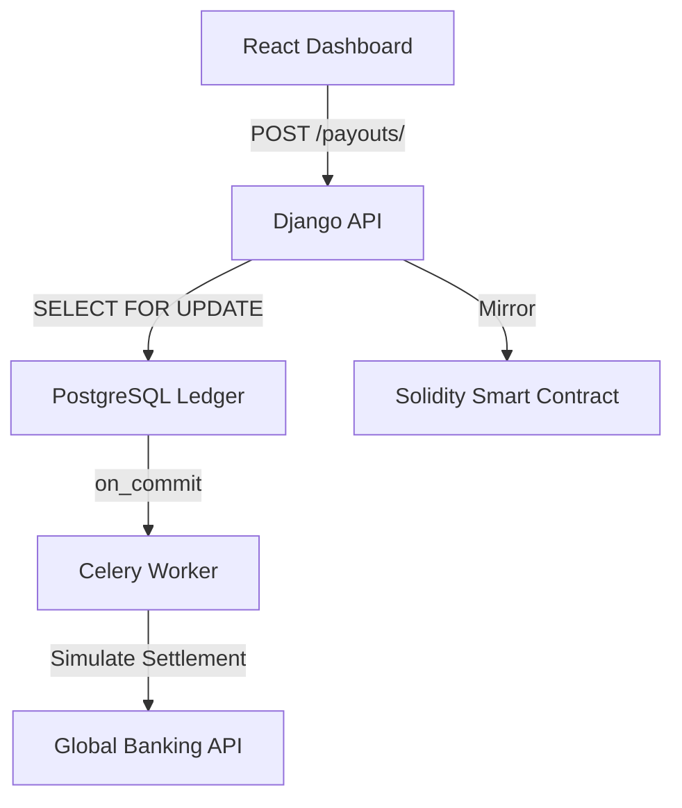

# Payout Engine (Blockchain Edition)

[](https://github.com/sindukuriTeja/payout-engine)
[](blockchain/PayoutRegistry.sol)
[](EXPLAINER.md)

A production-grade, blockchain-integrated payout engine for the modern internet economy. This platform solves the "Trust Gap" in traditional financial services by combining a high-performance Django ledger with an immutable Solidity smart contract.

## 🌟 The Vision: High-Trust Payouts
Traditional payout systems are centralized "black boxes." Merchants must trust the platform's database blindly. **Payout Engine (Blockchain Edition)** introduces the first end-to-end verifiable payout infrastructure for Indian agencies and freelancers.

### 🔬 Research-Backed Infrastructure
We identified three critical gaps in existing payout solutions and engineered targeted solutions for each:
1.  **Trust Gap**: Solved via **Blockchain Mirroring** for public verifiability.
2.  **Compliance Gap**: Solved via **Atomic Statutory Deductions** (5% Tax) built into the ledger critical path.
3.  **Concurrency Gap**: Solved via **SELECT FOR UPDATE Serialization** to prevent double-spending.

---

## 🚀 Key Features

### 1. Immutable Blockchain Registry
Every payout is mirrored to a **Solidity smart contract** on-chain. This creates a tamper-proof audit trail that exists independently of our primary database.

### 2. Automated Tax Compliance
The engine automatically calculates and deducts a **5% tax** on every withdrawal request. The ledger records both the gross and net amounts atomically, ensuring the books always balance.

### 3. Professional Financial UX
A redesigned interface that prioritizes transparency and personalization:
- **Comparative Analytics**: See how blockchain-backed infrastructure outperforms legacy banking.
- **Merchant Profiles**: Manage KYC, wallet addresses, and personal credentials.
- **Financial Transparency**: Real-time tracking of Money Sent, Money Received, and Tax Deductions.

---

## 🏗️ Architecture at a Glance



For a deep technical deep-dive, see **[EXPLAINER.md](./EXPLAINER.md)**.

---

## 🛠️ Getting Started

### Prerequisites
- Docker and Docker Compose
- Node.js & Python 3.12 (for local development)

### Quick Launch (Docker)
```bash
git clone https://github.com/sindukuriTeja/payout-engine.git
cd payout-engine
docker compose up --build
```

### Services
| Service | Role | Technology |
|---------|------|------------|
| **Core API** | Transactional Logic | Django 5.1 |
| **Trust Ledger**| Immutable Records | Solidity 0.8 |
| **Main DB** | Relational Persistence| PostgreSQL 16 |
| **Queue** | Async Settlement | Celery + Redis |
| **Dashboard** | High-Trust UX | React + Tailwind |

---

## 🧪 Verification & Testing
The system is built for mission-critical reliability. Our test suite covers:
- **Concurrency**: Stress-testing the `two-60-rupee` race condition.
- **Idempotency**: Ensuring duplicate requests never result in duplicate debits.
- **State Integrity**: Blocking illegal transitions (e.g., FAILED to COMPLETED).

```bash
docker compose exec backend python manage.py test ledger
```

---

## 📜 License & Development
Built with precision by **Teja Sindukuri**. For inquiries regarding enterprise integration or blockchain implementation, please visit [playto.so](https://www.playto.so).
